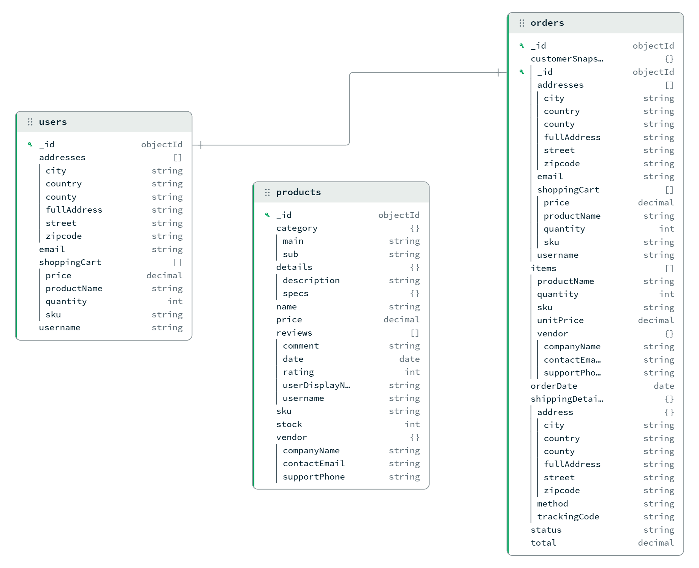
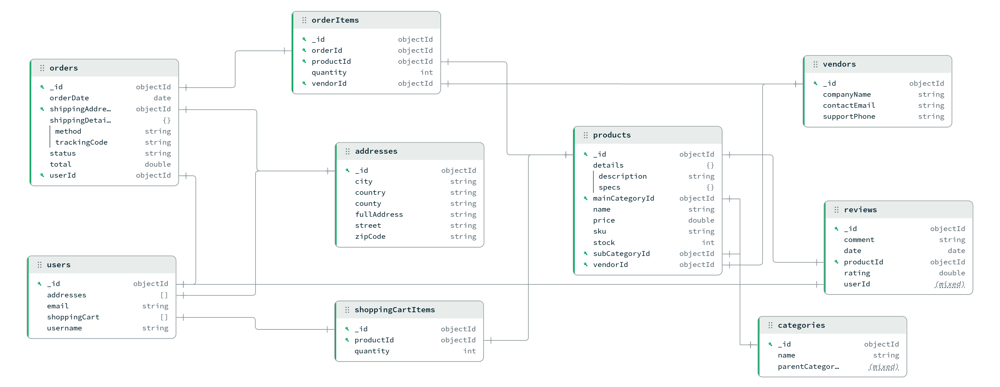
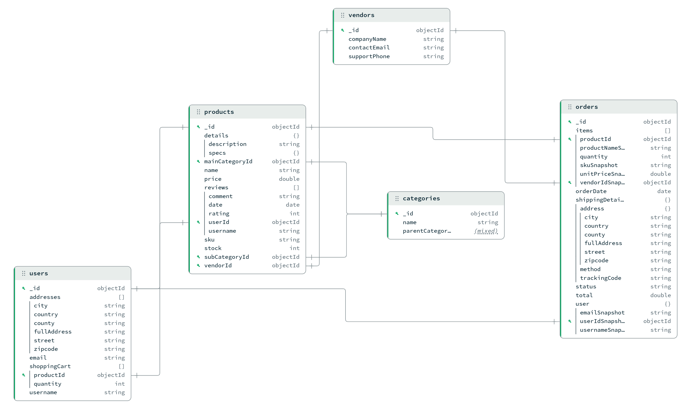

# Schema Design Strategies and Scaling Solutions in MongoDB in E-Commerce

## Data Modeling & Collection Organization
&nbsp;&nbsp;&nbsp;&nbsp;This section outlines the main schema-design approaches for e-commerce data in MongoDB and explains how to choose between embedding, referencing, or a hybrid model based on access patterns, update frequency, and document size.

- #### MongoDB versus SQL Approaches

&nbsp;&nbsp;&nbsp;&nbsp;The most distinct operational difference lies in how data structures are defined. SQL databases enforce a rigid model, where table structures and data types must be strictly defined before any data ingestion, making schema migrations complex and slow. MongoDB utilizes a flexible approach, allowing for polymorphic documents within the same collection, whih enables rapid iteration and the storage of heterogenous data (such as different attribute sets for different types of documents) without requiring database-wide downtime or complex migratipn scripts.
&nbsp;&nbsp;&nbsp;&nbsp;SQL and MongoDB take opposing stances on data redundancy to optimize for different goals. SQL prioritizes Normalization, breaking data into distinct logical tables to eliminate duplication. MongoDB often favors Denormalization, deliberately introducing controlled redundancy (Embedding) to keep related data together.
&nbsp;&nbsp;&nbsp;&nbsp;When handling growth, the two technologies default to different architectural paths. SQL databases typically rely on Vertical Scaling (Scale-Up), where performance bottlenecks are resolved by upgrading the hardware of a single server, a strategy that eventually hits a physical cost-performance ceiling. MongoDB is engineered natively for Horizontal Scaling (Scale-Out) via Sharding. This allows the database to distribute massive datasets and high-throughput write loads across a cluster of servers, offering a relatively linear path to scaling storage and performance.

&nbsp;

### 1. Modeling Strategies

- ##### Embedding Strategy

&nbsp;&nbsp;&nbsp;&nbsp;Choosing to embed everything (and avoid references completely; exception: orders referencing users when embedding the entire 'customerSnapshot') is designed for extreme read performance and data isolation. Denormalizing helps retrieve the entire entity someone wants to query in a single disk seek.
&nbsp;&nbsp;&nbsp;&nbsp;Snapshotting (i.e. Historical Data Integrity) refers to saving past data values for business and data logic. If, for example, a Product price changes after some time, the past Order must not change, but keep the old price in the database. Embedding creates immutable "snapshots" of the data at a specific moment in time.
&nbsp;&nbsp;&nbsp;&nbsp;Another benefit is that the data in the database looks exactly like the data the Frontend of an e-commerce store needs; so no complex backend logic is needed to put data together before sending it.
&nbsp;&nbsp;&nbsp;&nbsp;The important trade-off is that, even if it offers high speed read, relying on embedding data makes the database write actions heavy (due to data redundancy): 1 document update should change the stored value in almost every place where it's embedded.

- ##### Referencing Strategy

&nbsp;&nbsp;&nbsp;&nbsp;The Referencing Strategy implements a Normalized Data Model, effectively replicating a relational database structure (SQL-like) within MongoDB. As illustrated in the diagram, data is distributed across highly granular collections to ensure strict separation of concerns.
&nbsp;&nbsp;&nbsp;&nbsp;The most significant advantage of this architecture is that it provides maximum Data Consistency. Because the data is normalized, an update to a master record (such as a vendor changing their contact email) is performed on a single document in the vendors collection and is instantly reflected logically across all products that reference it.
&nbsp;&nbsp;&nbsp;&nbsp;However, this comes at the cost of Read Performance: retrieving complex hierarchical data (like a full order history) requires resource-intensive $lookup (JOIN) operations across multiple collections (orders, orderItems, and products) which significantly increases the execution time of aggregation pipelines.

- ##### Hybrid Strategy

&nbsp;&nbsp;&nbsp;&nbsp;Widely considered the "gold standard", a hybrid schema (i.e. a schema that uses embedding, but also referencing) balances the speed of embedding and the scalability of referencing. A hybrid schema stores a limited amount of frequently accessed data OR high-volatility data (e.g. product prices), but also keeps the full detailed data in a separate collection, accessed through referencing.
&nbsp;&nbsp;&nbsp;&nbsp;Most of the times pure embedding fails (the documents grow endlessly, e.g. products that get lots of reviews, eventually hitting the size limit). Pure referencing fails too, because complex queries and pipelines will end up being too slow. 
&nbsp;&nbsp;&nbsp;&nbsp;Unlike the "pure" approaches, a hybrid approach offers reduced IOPS (Input/Output Operations): the most used snippets of other objects/documents are probably already stored in the main document we need, but if we need all data (or a big chunk of it) we can look it up through referencing.

### 2. Comparative Analysis

| Aspect | Embedding | Referencing | Hybrid |
|---|---|---|---|
| Data Consistency | Strong Consistency (Single Document)   Weak Consistency (Duplicated Data)  | Very Strong Consistency   (Single Source of Truth) | Strong Consistency (Referenced Data)   Weak Consistency (Embedded Data) |
| Data Redundancy | High & Uncontrolled | Very Low   (Zero Duplication) | Partial & Strategic |
| Performance | Read: Very High   Write: Low-Moderate | Read: Low   Write: Very High | Read: High   Write: Moderate |
| Flexibility | Low: data is "trapped" inside the parent | Very High: independent and granular data | Moderate: usually optimized for a specific structure |

&nbsp;

## CRUD Operations

&nbsp;&nbsp;&nbsp;&nbsp;Due the project focus, only the base-level CRUD operations were implemented for each collection (create, find-one, find-all, update-one, delete-one). Users can use the "input" and "jsonCollectionStructure" files as input guides for CRUD operations.

&nbsp;

## Optimization Strategies

### 1. Queries

&nbsp;&nbsp;&nbsp;&nbsp;We first ran 10 queries without indexes. (in parantheses you can see the values used for the queries)
> Queries List:
> Q1: Product by SKU. ('ELE-ACC-12550')
> Q2: Products by main and sub category. (main: 'Electronics', sub: 'Laptops')
> Q3: Text search products. ('gaming laptop')
> Q4: User by email. ('dennisparker@gmail.com')
> Q5: Users by zipcode. ('N9F 2WT')
> Q6: Orders by data range. (from '01.01.2021' to '31.12.2021')
> Q7: Orders by status. ('Delivered')
> Q8: Orders by customer email. ('sebastianhawkins@outlook.com')
> Q9: Orders containing SKU. ('HOM-DEC-10967')
> Q10: Orders that are pending. ('Pending')

&nbsp;

### 2. Pipelines

&nbsp;&nbsp;&nbsp;&nbsp;We first ran 3 pipelines without indexes.
> Pipelines List:
> P1: Ranked list of products with average rating bigger than 4, based on customer reviews.
> P2: Users whose current shopping cart value exceeds 100.
> P3: Vendors who have generated more than 1000 in revenue.

&nbsp;

### 3. Indexes

&nbsp;&nbsp;&nbsp;&nbsp;To optimize system performance, we analyzed the queries (Q1-Q10) and aggregation pipelines (P1-P3). We implemented strategic indexes to transition from resource-heavy collection scans to efficient index scans. Key implementations include Unique Indexes for data integrity, Compound Indexes for complex filtering, and Partial Indexes which minimize storage overhead by indexing only relevant subsets of data. The tables below demonstrate the significant reduction in execution time achieved.
> Common Indexes List:
> I1: productsSkuUnique
> I2: productsText
> I3: usersEmailUnique
> I4: usersAddressesZipcode
> I5: ordersOrderDateIdx
> I6: ordersStatusIdx
> I7: ordersCustomerEmailDate
> I8: ordersItemsSku
> I9: ordersPendingPartial

Note: even though common indexes have different database implementations (i.e collection/field/structural differences due to database structure differences), they have and serve the same database logic.

&nbsp;
- ##### Embedding Database
> Database-Level Indexes List:
> I1: productsCategoryCompound

| Querying | Without Indexes (ms) | With Indexes (ms) |
|---|---|---|
| Q1 | 6 | 0 |
| Q2 | 3 | 0 |
| Q3 | 7 | 0 |
| Q4 | 1 | 1 |
| Q5 | 1 | 0 |
| Q6 | 10 | 2 |
| Q7 | 7 | 3 |
| Q8 | 8 | 0 |
| Q9 | 21 | 0 |
| Q10 | 7 | 2 |

| Pipelining | Inefficient Without Indexes (ms) | Inefficient With Indexes (ms) | Efficient With Indexes (ms) |
|---|---|---|---|
| P1 | 49 | 47 | 29 |
| P2 | 17344 | 329 | 328 |
| P3 | 109 | 109 | 110 |

&nbsp;

- ##### Referencing Database
> Database-Level Indexes List:
> I1: productsMainPartial
> I2: productsSubPartial

| Querying | Without Indexes (ms) | With Indexes (ms) |
|---|---|---|
| Q1 | 2 | 0 |
| Q2 | 3 | 1 |
| Q3 | 6 | 0 |
| Q4 | 0 | 1 |
| Q5 | 1 | 0 |
| Q6 | 9 | 2 |
| Q7 | 5 | 2 |
| Q8 | 6 | 0 |
| Q9 | 31 | 0 |
| Q10 | 5 | 2 |

| Pipelining | Inefficient Without Indexes (ms) | Inefficient With Indexes (ms) | Efficient With Indexes (ms) |
|---|---|---|---|
| P1 | 71721 | 75106 | 49278 |
| P2 | 583 | 623 | 592 |
| P3 | 2914 | 3187 | 3082 |

&nbsp;

- ##### Hybrid Database
> Database-Level Indexes List:
> I1: productsMainPartial
> I2: productsSubPartial

| Querying | Without Indexes (ms) | With Indexes (ms) |
|---|---|---|
| Q1 | 7 | 0 |
| Q2 | 3 | 1 |
| Q3 | 7 | 0 |
| Q4 | 1 | 1 |
| Q5 | 1 | 0 |
| Q6 | 9 | 2 |
| Q7 | 6 | 2 |
| Q8 | 8 | 0 |
| Q9 | 20 | 0 |
| Q10 | 6 | 2 |

| Pipelining | Inefficient Without Indexes (ms) | Inefficient With Indexes (ms) | Efficient With Indexes (ms) |
|---|---|---|---|
| P1 | 45 | 45 | 28 |
| P2 | 308 | 332 | 325 |
| P3 | 89 | 87 | 87 |

&nbsp;

## Scaling Strategies

### 1. Vertical Scaling (Scale Up)

&nbsp;&nbsp;&nbsp;&nbsp;Vertical Scaling ("Scale Up") involves upgrading a single server with more powerful hardware (specifically more RAM, faster CPUs, better storage). It is the simplest and most common initial strategy, boosting performance instantly without requiring any changes to the database architecture or application code.
&nbsp;&nbsp;&nbsp;&nbsp;The main driver for vertical scaling is memory. MongoDB performs best when it's "Working Set" (all indexes & frequently accessed data) fits entirely inside the server's RAM. If data outgrows the available memory, performance drops significantly. Upgradind to a server with more RAM solves this bottleneck immediately.
&nbsp;&nbsp;&nbsp;&nbsp;This strategy has a physical limit. Eventually, we can reach the maximum capacity of a single machine (or the cost becomes unsustainable). Once this hardware ceiling is hit, we can no longer scale up and must switch to horizontal scaling.
&nbsp;&nbsp;&nbsp;&nbsp;In Atlas, vertical scaling means upgrading the "Cluster Tier". Users do not manage the hardware directly, but simply select the new capacity needed, and Atlas provisions the underling the infrastructure for them.

### 2. Horizontal Scaling (Sharding)

&nbsp;&nbsp;&nbsp;&nbsp;Horizontal scaling ("Scale out") solves the limits of a single server by distributing data across multiple servers, or "shards". Instead of buying better hardware, you buy more. 
&nbsp;&nbsp;&nbsp;&nbsp;To distribute the data, MongoDB uses a Shard Key (a user-chosen field). Based on this key, the database automatically chops the data into chunks and spreads them evenly across the shards. Users connect to a router (mongos), which knows exactly which server(servers) holds(hold) the needed data.

&nbsp;&nbsp;&nbsp;&nbsp;We decided to split out databases in 3 shards each. You can analyze the querying/pipelining performance below.

- ##### Embedding Database Sharding

| Querying (each shard) | Without Indexes (ms) | With Indexes (ms) |
|---|---|---|
| Q1 | 1, x, x | 0, x, x |
| Q2 | 2, 2, 2 | 0, 0, 0 |
| Q3 | 4, 4, 6 | 0, 0, 0 |
| Q4 | 0, 0, 0 | 0, 1, 1 |
| Q5 | 0, 0, 0 | 0, 0, 0 |
| Q6 | 0, 0, 9 | 0, 0, 0 |
| Q7 | 0, 8, 0 | 0, 8, 0 |
| Q8 | 0, 9, 0 | 0, 0, 0 |
| Q9 | 0, 20, 0 | 0, 0, 0 |
| Q10 | 0, 14, 0 | 0, 4, 0 |

| Pipelining (each shard) | Inefficient Without Indexes (ms) | Inefficient With Indexes (ms) | Efficient With Indexes (ms) |
|---|---|---|---|
| P1 | 23, 20, 17 | 38, 39, 25 | 29, 36, 31 |
| P2 | 11475, 11315, 11067 | 2783, 2773, 2763 | 2907, 2860, 2894 |
| P3 | 0, 242, 0 | 0, 184, 0 | 0, 183, 0 |

&nbsp;

- ##### Referencing Database Sharding

| Querying (each shard) | Without Indexes (ms) | With Indexes (ms) |
|---|---|---|
| Q1 | 0, 0, 0 | 0, 0, 1 |
| Q2 | 0, 0, 0 | 0, 0, 0 |
| Q3 | 2, 2, 2 | 0, 0, 0 |
| Q4 | 0, 0, 0 | 0, 0, 0 |
| Q5 | 0, 0, 0 | 0, 0, 0 |
| Q6 | 2, 1, 1 | 0, 0, 0 |
| Q7 | 2, 1, 1 | 1, 1, 1 |
| Q8 | x, 1, x | x, 0, x |
| Q9 | 8, 7, 8 | 0, 0, 0 |
| Q10 | 2, 2, 2 | 1, 1, 1 |

| Pipelining (each shard) | Inefficient Without Indexes (ms) | Inefficient With Indexes (ms) | Efficient With Indexes (ms) |
|---|---|---|---|
| P1 | 687, 664, 691 | 720, 688, 718 | 735, 709, 737 |
| P2 | 2902, 2777, 2589 | 3106, 2984, 2781 | 3172, 3049, 2852 |
| P3 | 7544, 7394, 7579 | 7679, 7497, 7701 | 7928, 7783, 7986 |

&nbsp;

- ##### Hybrid Database Sharding

| Querying (each shard) | Without Indexes (ms) | With Indexes (ms) |
|---|---|---|
| Q1 | 1, x, x | 0, x, x |
| Q2 | 3, 3, 2 | 3, 1, 1 |
| Q3 | 10, 7, 6 | 1, 1, 1 |
| Q4 | 0, 0, 0 | 3, 2, 3 |
| Q5 | 0, 1, 1 | 0, 0, 0 |
| Q6 | 7, 9, 6 | 5, 6, 2 |
| Q7 | 13, 8, 4 | 1, 5, 7 |
| Q8 | 4, 6, 5 | 0, 0, 0 |
| Q9 | 10, 12, 21 | 0, 0, 0 |
| Q10 | 7, 9, 4 | 3, 5, 5 |

| Pipelining (each shard) | Inefficient Without Indexes (ms) | Inefficient With Indexes (ms) | Efficient With Indexes (ms) |
|---|---|---|---|
| P1 | 17, 11, 19 | 62, 66, 71 | 23, 20, 26 |
| P2 | 11397, 11196, 10819 | 9912, 9346, 8148 | 7531, 7084, 6544 |
| P3 | 99, 78, 85 | 103, 102, 83 | 119, 99, 102 |

## References